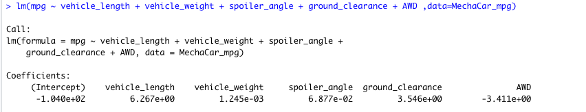
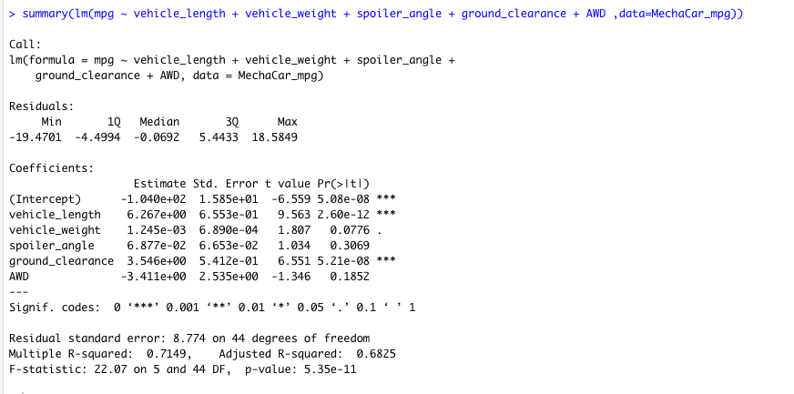
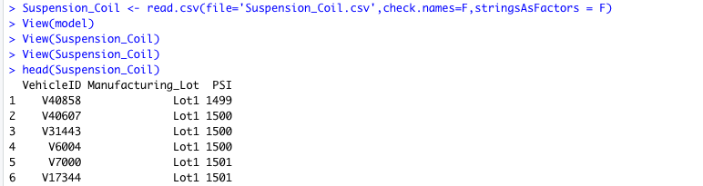
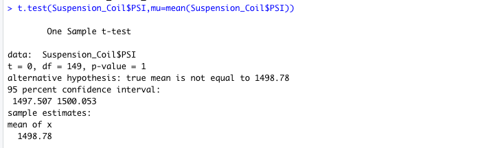

# MechaCar Statistical Analysis

## Linear Regression to Predict MPG

## Summary Statistics on Suspension Coils

## T-Test on Suspension Coils

## Study Design: MechaCar vs Competition

The statistical study that can quantify how the MechaCar performs against the competition is two-way ANOVA. 

We can test all differen kind of metrics such cost, city or highway fuel efficiency, horse power, maintenance cost, or safety rating.
